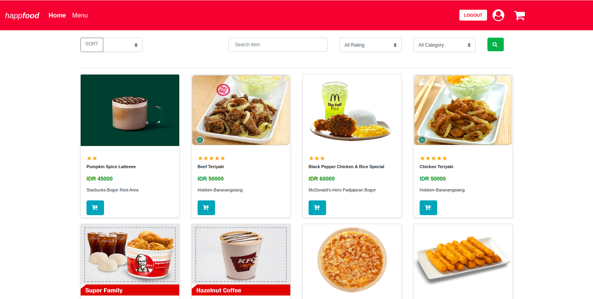
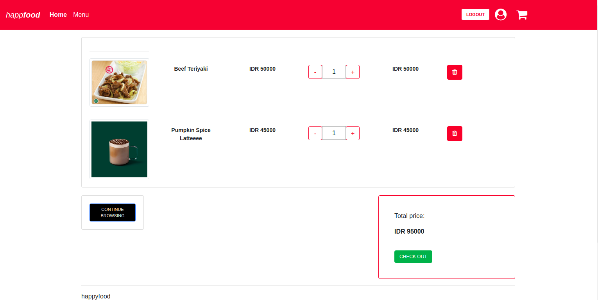
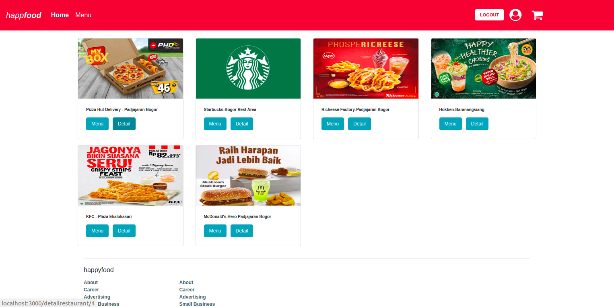
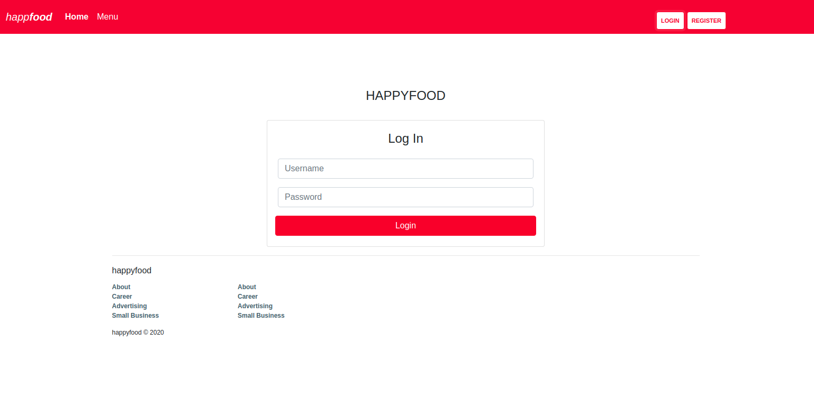

<h1 align="center">Happ Food - Food Delivery Web Front-End</h1>

Happ Food is an Online Food Delivery Web Front-End built using ReactJS Framework and Integrated with Fodel-API as the Back-End.

This project was bootstrapped with [Create React App](https://github.com/facebook/create-react-app).

## Screenshots

## Developing
1. Open your terminal or command prompt
2. Type `git clone https://github.com/amudia/happfood-reactjs.git`
3. Open the project directory and Type `npm install` to install all dependencies
4. Type `npm start` in the terminal or command prompt to run the App
5. Open `http://localhost:3000` to view the running App
